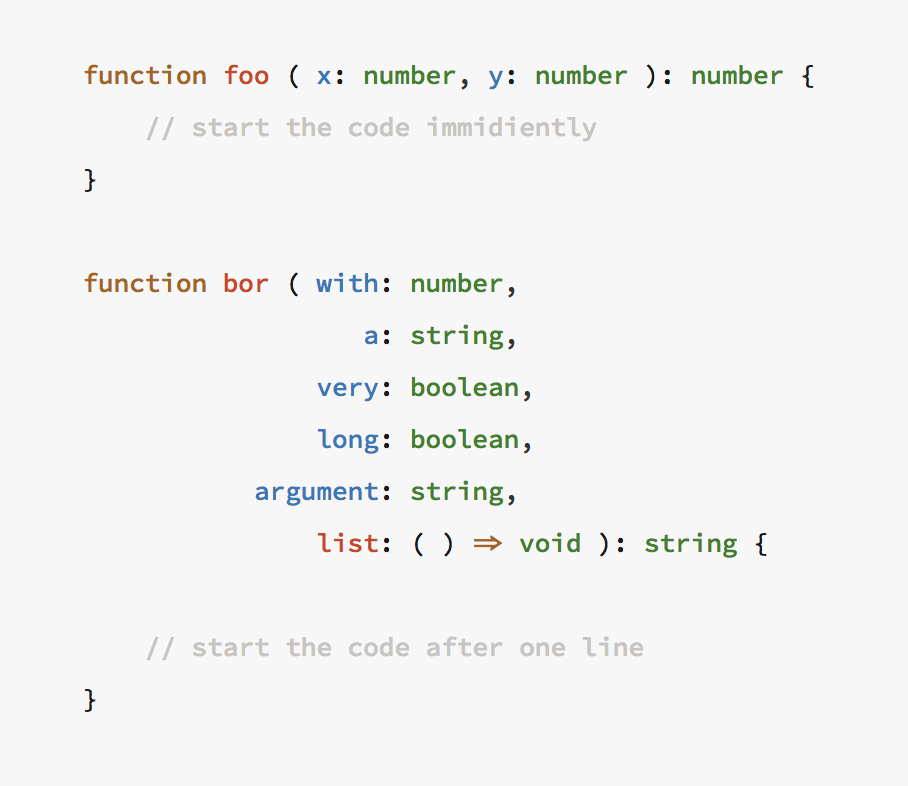
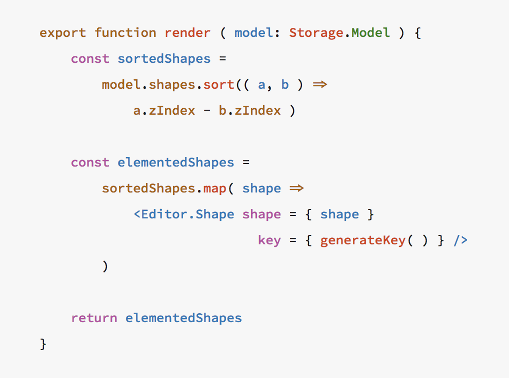
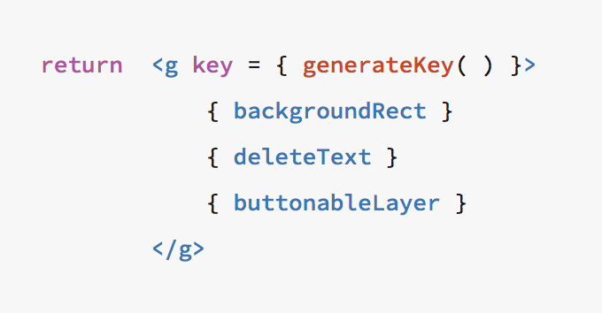
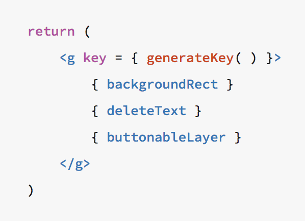
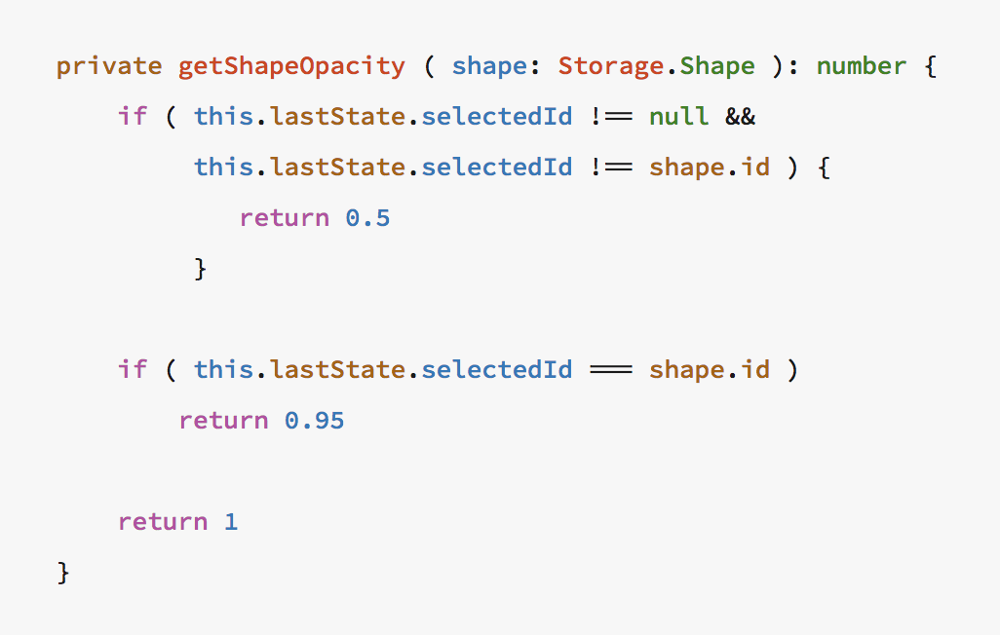

# Writing JavaScript

### Don't use semicolons

Semicolons are good, but they are not needed in ECMAScript. You can read [this post on how to code without semicolons](https://mislav.net/2010/05/semicolons/). Truth is while semicolons are optional and good to be used because everyone is using them, they are really ugly and by omitting them your code looks just a lot better and therefore semicolons are ignored within this standard.

Also remember that because this standard is designed for semicolon-less codes, you don't have to think about the edge cases because this standard automatically protects you from those kinds of problems.

### Spaces

Use spaces in a good way. Use at least one space before and after each parenthesis, braces, curly braces. Have at least an space after comma in the array and object notations. And always have at least one space before and after each operator. Only in case of an object or array inside a parentheses don't use spaces in between and have them as: `({ })`

### Functions

In functions have a space between the function name and it's parentheses. Also in the argument names and between the function's return type and braces. If your function got more than 80 character break it down to many lines like the Objective-C style and align the parameters under each other where : are all in one column. In this case remember to have a line between the function's declaration and start of your code.

When writing arrow functions remember to always separate the body from the definition by breaking them to two separate lines and have the body indented by one level.

If the arrow function has only one parameter, don't use parentheses. And in cases where the whole code is one line don't use braces.

### Variable & Constants

As a general rule try to define everything as constant, it's much more healthy code. Try to write the value of each variable / constant under them with a level of indentation. It makes your code much more organized and readable.

### Ternary Operator

When using ternary operator remember to always wrap the whole thing in a parentheses. Then write a first line with conditions and then after that write the ? : and \) like this example.

### JSX

JSX is a terrible element when it comes to readability and so you must be extra carful not to unleash the daemon underneath it. To write beautiful JSX use the Objective-C style of function parameters and align all the params with = under each other. Add extra spacing between names, = and the values and also keep the spacings within the the braces.

Remember that JSX is bad for readability so don't define anything within the braces. Use a string, number, variable or function call. But don't define a new function or calculate math and other stuff that can easily make your JSX a mess.

When returning a JSX don't use parentheses after the return statement. Use a tab character to move to the next column and then write your JSX with the tab's indentation. It's just way more beautiful and stylish:

The nice way to return a JSX with an extra tab after the return keyword and two tabs in the other lines to have the JSX formed beautifully.

### If

In if statements don't use braces if only one statement must happen. However use them if the condition is too big and the user might not be easily able to spot the statement. Remember that in case of long conditions break them to more than one line where the && or \|\| operators are at the end of the previous line and that both statements start at one character column \(notice the this.lastStates\)

