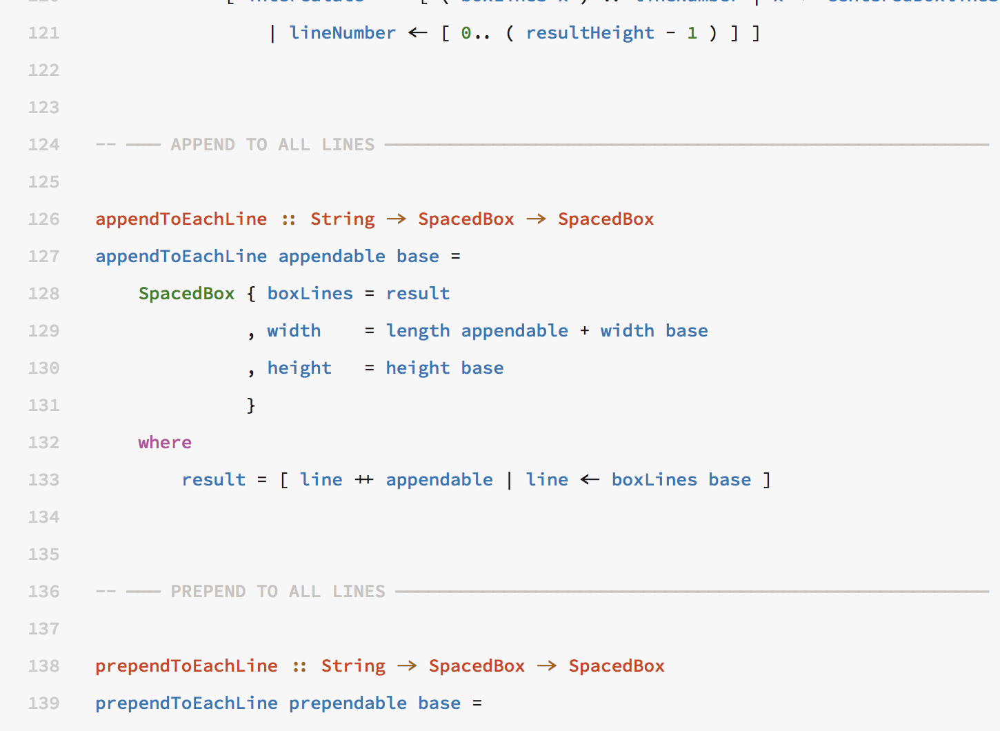
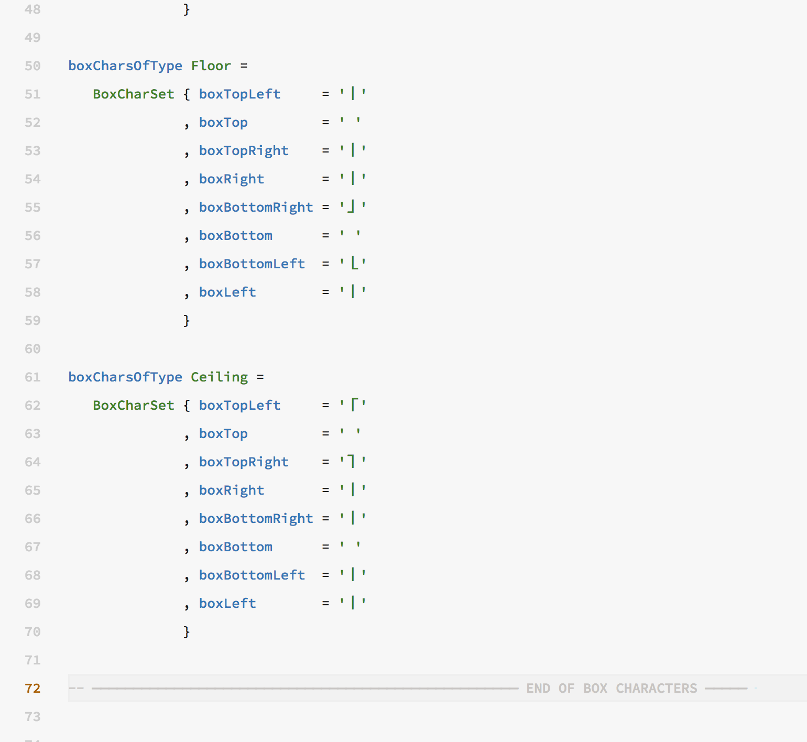
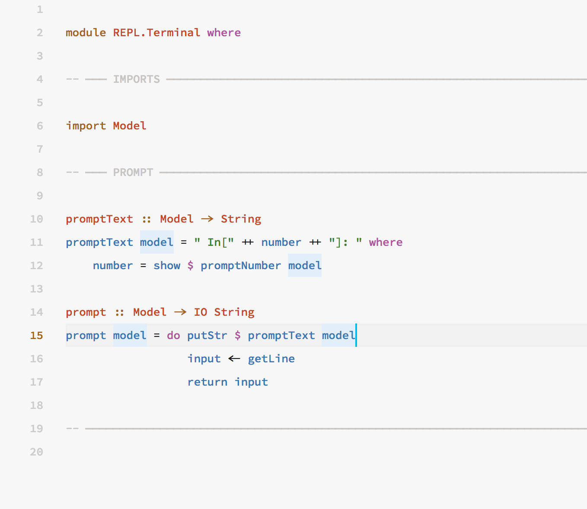

# Sectioning Code

## What a Section Comment is?

A section comment is a Kary Comment that names the section. See in this example how section comments have separated the parts. 



When dealing with a very long section; A "Reverse Section Comment" can be utilized to indicate the ending of that section



At the end of a series of sections, A line comment is used to decorate



## Indentation of Sections

In indentation sensitive language such as Python and Haskell, a compact version of Kary Comments is used. You can see that in space sensitive languages section comments are one line and in the insensitive they are 3 lines:

```text

//
// ─── TITLE ──────────────────────────────────────────────────────────────────────
//

# ─── TITLE ──────────────────────────────────────────────────────────────────────

```

But also in case insensitive languages, there is a level of indentation introduced after using the section comment as this:



Kary Coding Standard is based on the idea of 4 space tabs. It is also important to write codes with spaces to keep the layout the same everywhere.



