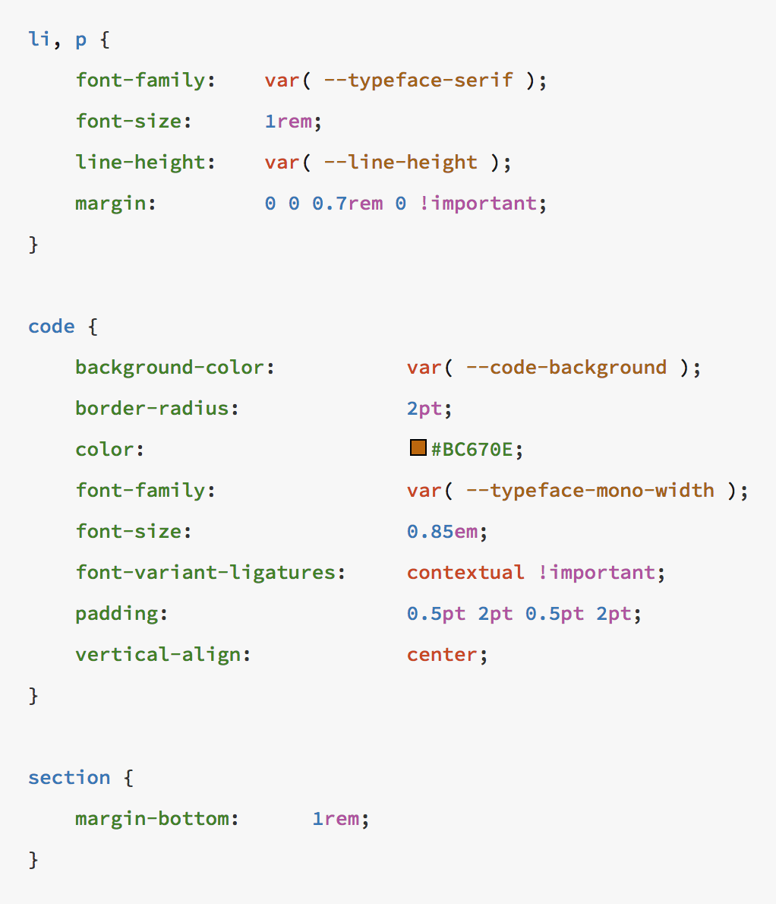
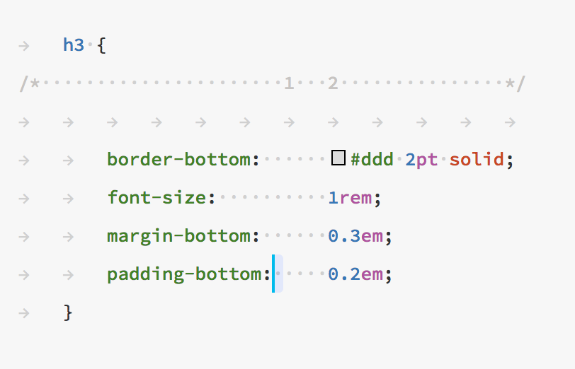
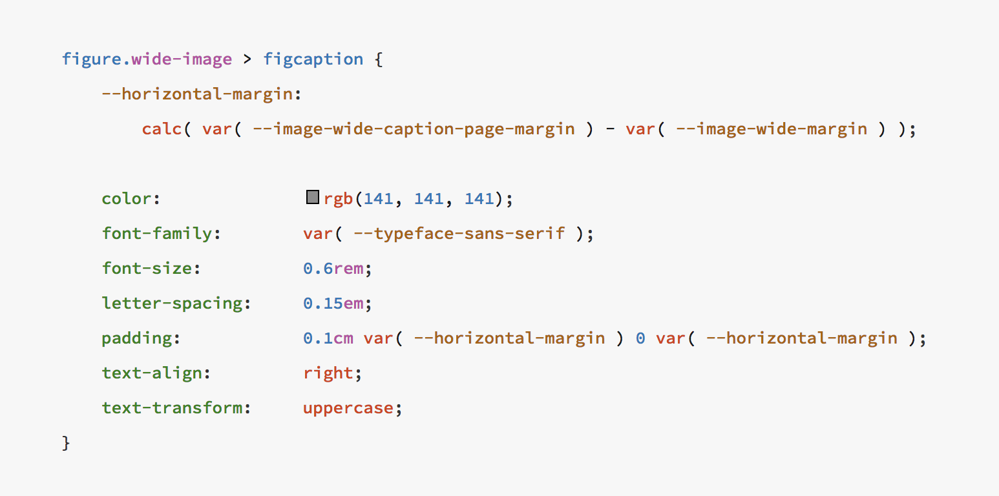
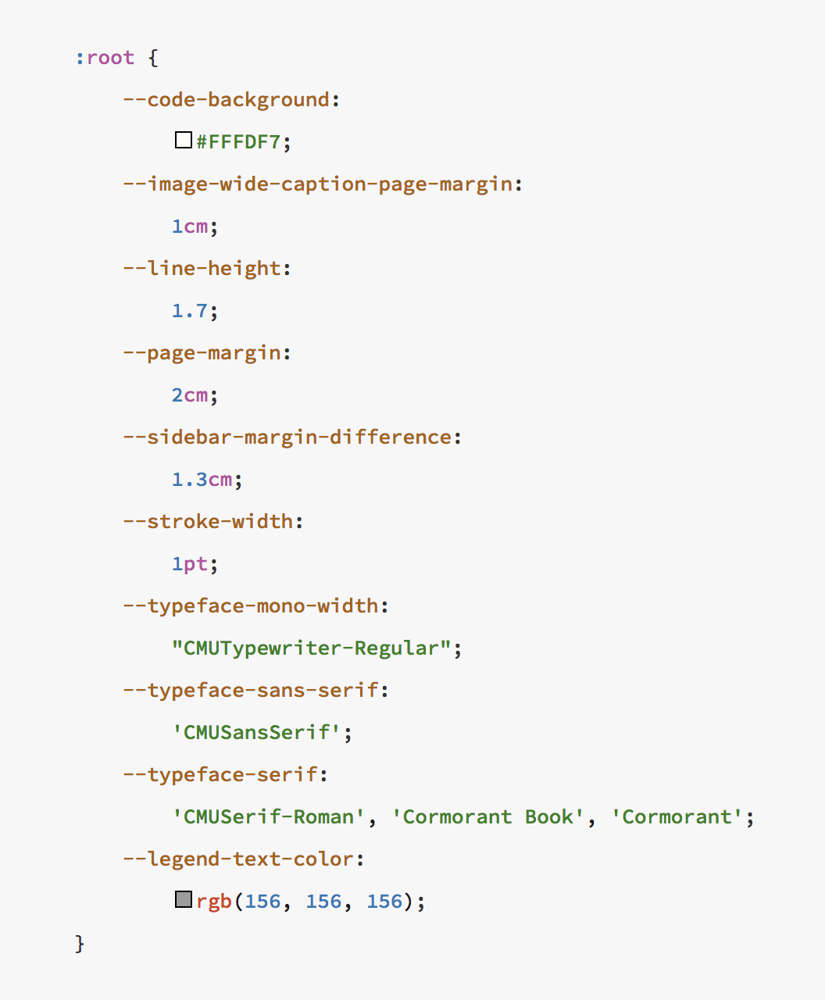
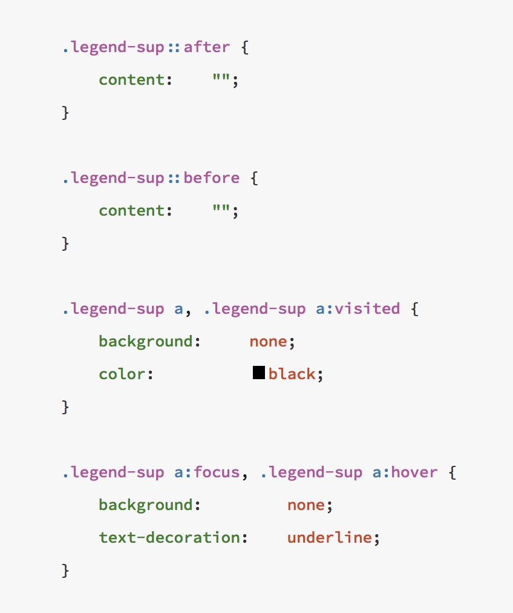
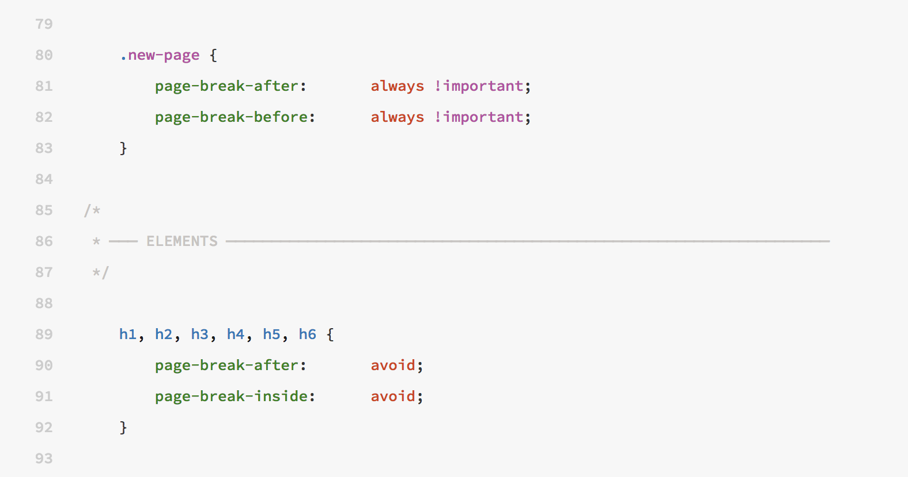

# CSS Family


You are reading a draft edition of this document. If you found any errors, please report them to [kary@gnu.org](mailto:kary@gnu.org)



**Righteous** is an experimental code formatter engine that implements the Kary Coding Standard for CSS language. You can simply utilize it within your editor of choice and have all the formatting done for you. 




## The Rule Of Columns

CSS is basically a sheet of settings and therefore, putting rules into two columns and showing them as a table is the most convenient way of formatting CSS. The basic rule of columns here is that that each column must begin at a tab and the space between the two columns must be at least 2 characters.

Here as you can see the tabs and spaces are rendered with arrows and dots. Now if you look at the column of properties it has started at the tab that is aligned to the number 2. The reason is, if it started at column 1 then the number of characters between the two columns would have been 1 char \(as the selection shows\)


You don't have to write this by hand and worry about it since it is automatically done by [Righteous](../tools/righteous.md). 


## Property Spacings

Very much like the other languages, it is encouraged to have a whitespace after `(` and one before `)` 


Since it is encouraged and not enforced; Righteous does not format the properties of a rule and therefore it is the user's decision to write the rules in this way. 


## Variables

CSS Variables are nice additions to CSS and to have them rendered beautifully we have a special rule about them. Since variables are no settings, they have to be separated from the settings and that's why they should be defined in the top of the rule and separated by one empty line to the settings

Also as you can see in the example, the way of writing variables is much different. They are written with their values in the next line and indented by one tab. In case of many variables, they have to be written below each other without any spacing

## Rule Spacing

Rules much be separated by one line as demonstrated in this figure:

## Kary Comments

When used, [Kary Comments](../comments/introduction.md) must be applied with their respective one level of indentation. Also, it is a necessity that Line Comments decrease one level of indentation.




Righteous knows the Kary Comments and is able to automatically apply the needed formatting when finding one. Yet, it is necessary to understand that Righteous does not turn ordinary comment to Kary Comments and they have to be generated by the user.


## Imports

Imports must be written with no spacing between them

## Multiple Selectors in One Rule

A radical but nice idea is to have all the selectors in one line, beautifully written as below and that's exactly how this standard implements them.

