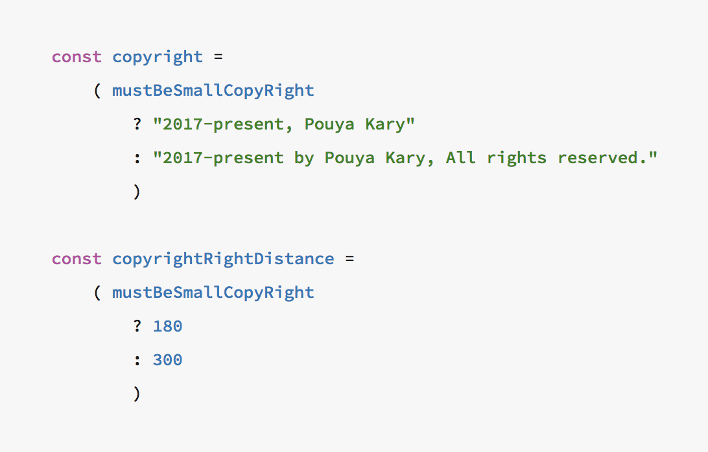
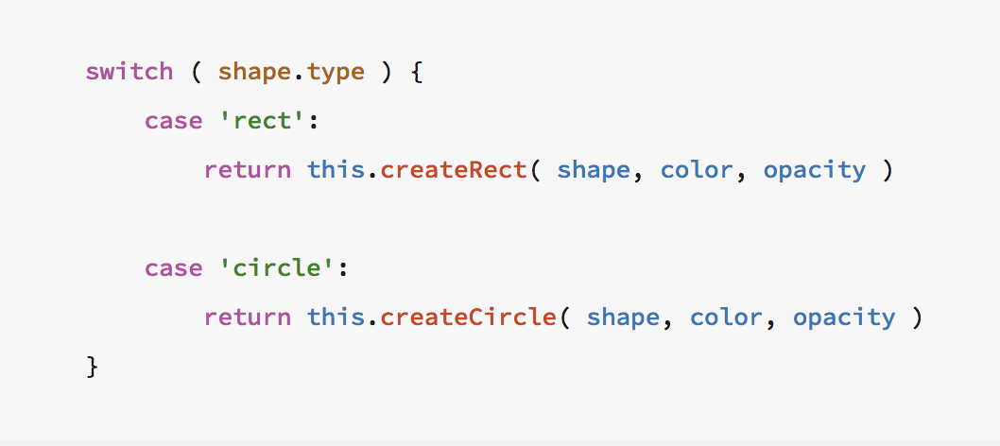
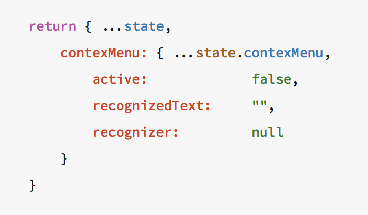
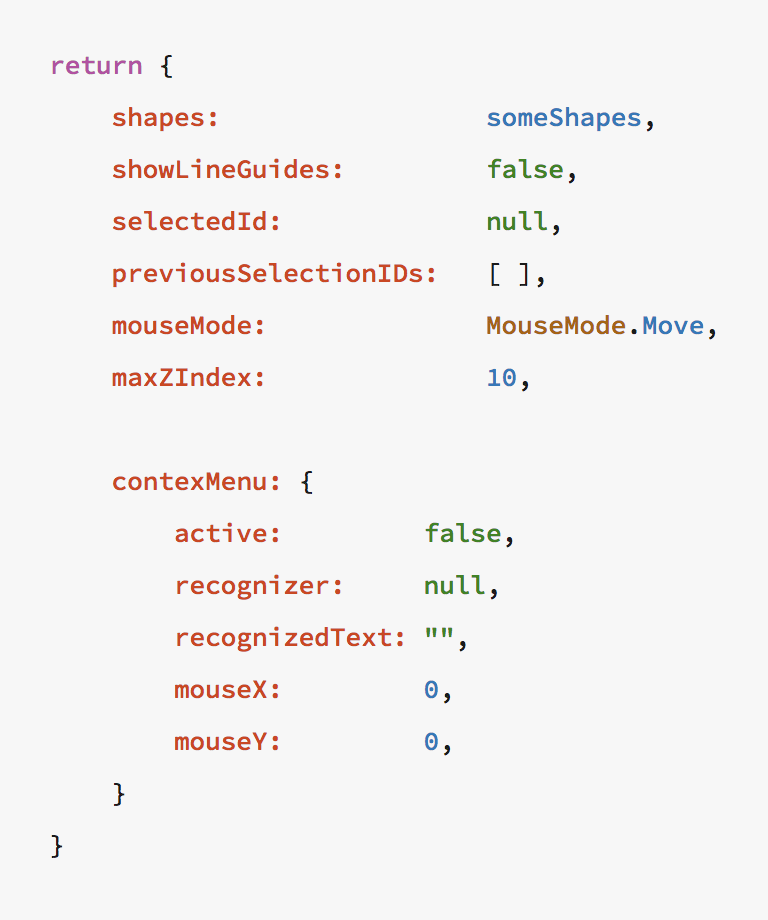
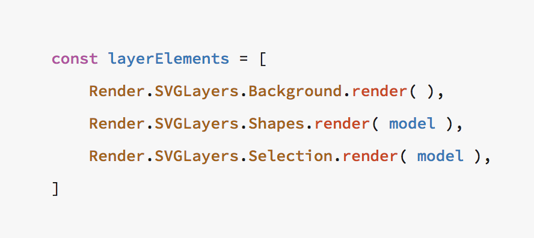
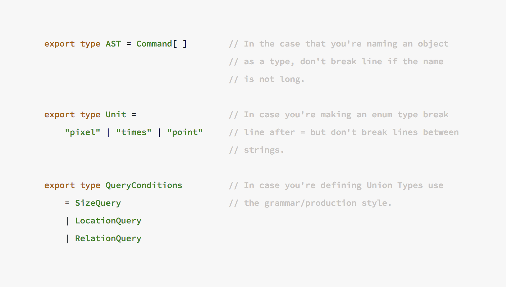
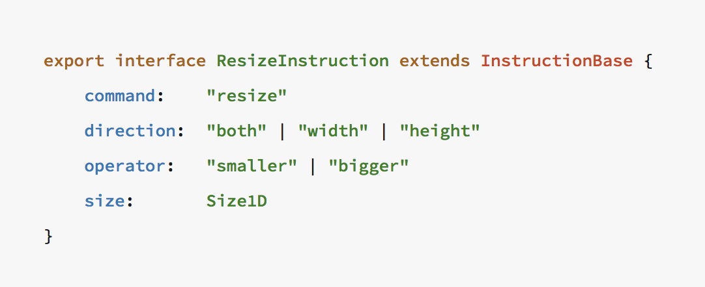
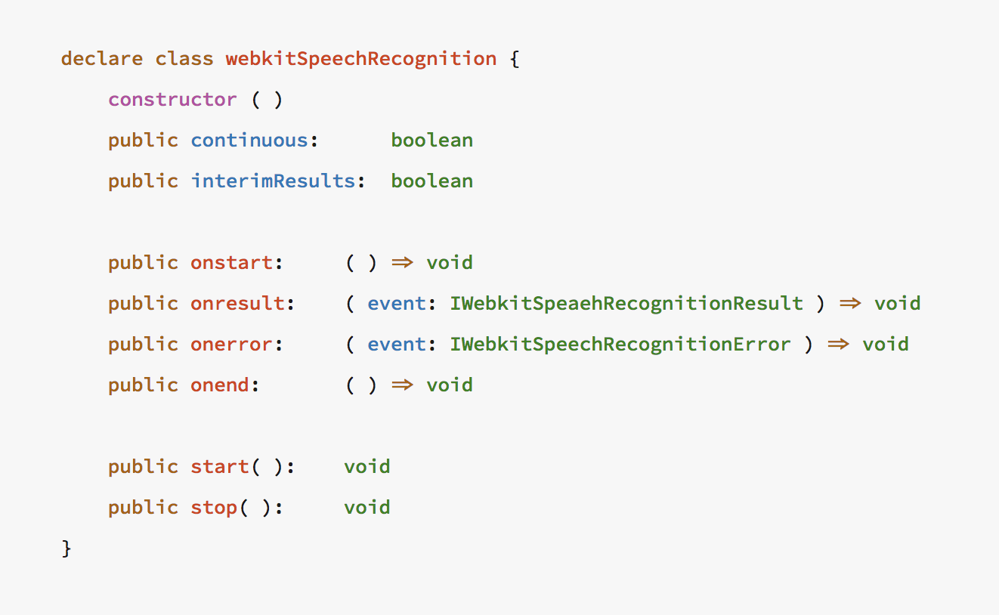
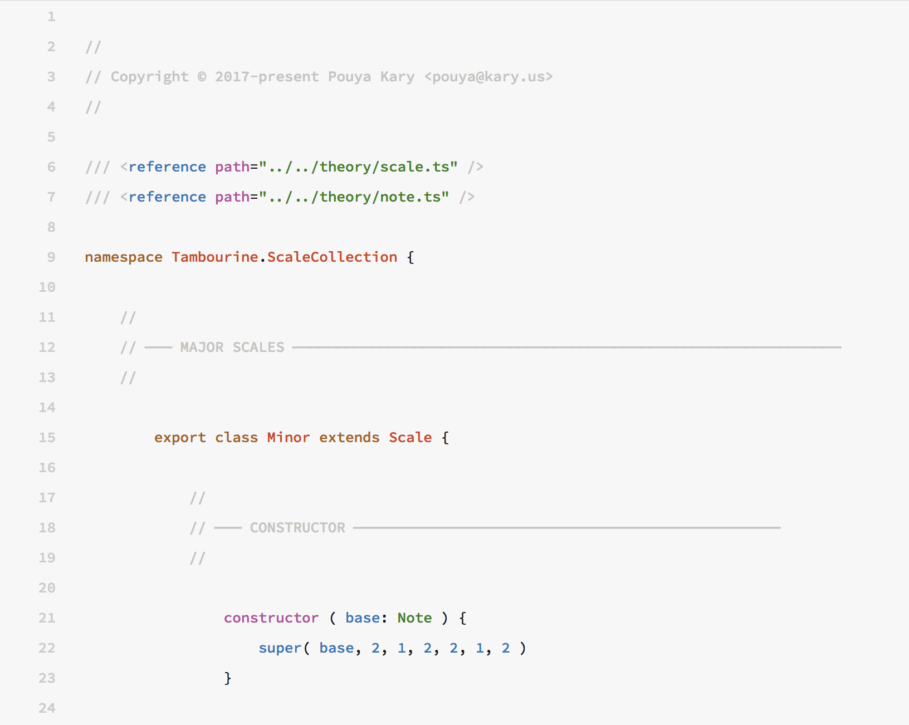
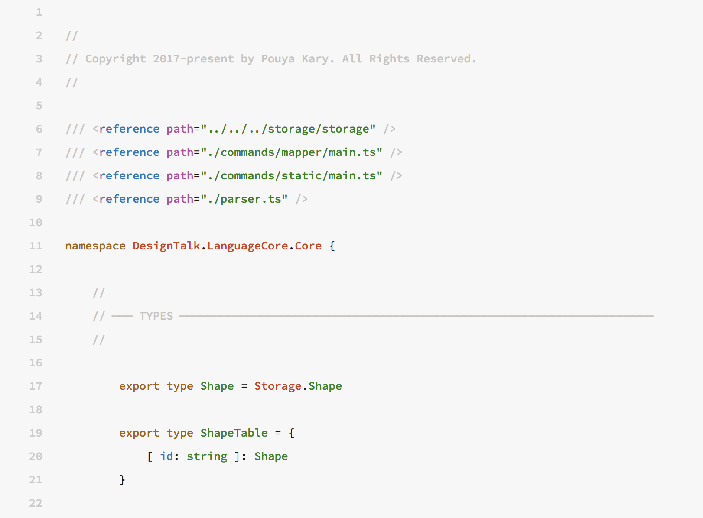

# JavaScript Family

## Don't use Semicolons

Semicolons are good, but they are not needed in ECMAScript. You can read [this post on how to code without semicolons](https://mislav.net/2010/05/semicolons/). Truth is while semicolons are optional and good to be used because everyone is using them, they are really ugly and by omitting them your code looks just a lot better and therefore semicolons are ignored within this standard.

Also remember that because this standard is designed for semicolon-less codes, you don't have to think about the edge cases because this standard automatically protects you from those kinds of problems.

## Spaces

Use spaces in a good way. Use at least one space before and after each parenthesis, braces, curly braces. Have at least an space after comma in the array and object notations. And always have at least one space before and after each operator. Only in case of an object or array inside a parentheses don't use spaces in between and have them as: `({ })`

## Functions

In functions have a space between the function name and it's parentheses. Also in the argument names and between the function's return type and braces. If your function got more than 80 character break it down to many lines like the Objective-C style and align the parameters under each other where `:` are all in one column. In this case remember to have a line between the function's declaration and start of your code.

When writing arrow functions remember to always separate the body from the definition by breaking them to two separate lines and have the body indented by one level.

If the arrow function has only one parameter, don't use parentheses. And in cases where the whole code is one line don't use braces.

## Variable & Constants

As a general rule try to define everything as constant, it's much more healthy code. Try to write the value of each variable / constant under them with a level of indentation. It makes your code much more organized and readable.

## Ternary Operator

When using ternary operator remember to always wrap the whole thing in a parentheses. Then write a first line with conditions and then after that write the `?` `:` and `)` like this example.

## JSX

JSX is a terrible element when it comes to readability and so you must be extra carful not to unleash the daemon underneath it. To write beautiful JSX use the Objective-C style of function parameters and align all the params with = under each other. Add extra spacing between names, = and the values and also keep the spacings within the the braces.

Remember that JSX is bad for readability so don't define anything within the braces. Use a string, number, variable or function call. But don't define a new function or calculate math and other stuff that can easily make your JSX a mess.

When returning a JSX don't use parentheses after the return statement. Use a tab character to move to the next column and then write your JSX with the tab's indentation. It's just way more beautiful and stylish:

The nice way to return a JSX with an extra tab after the return keyword and two tabs in the other lines to have the JSX formed beautifully.

## Control Structures

In these control structures don't use braces if only one statement must happen. However use them if the predicate is too big and the user might not be easily able to spot the statement. Remember that in case of long conditions break them to more than one line where the `&&` / `||` / `;`  operators are at the end of the previous line and that both statements start at one character column \(notice the `this.lastState`s\)

### Switch

In writing switches only notice to have the cases be indented by one level in the main switch body.

## Objects

If you're cloning an object with spread operator use the spread operator ofter the beginning of the object within the first line. Then remember to use enough tabs ofter the object keys that their values be aligned under a new column.

When you have nested objects within the object you're defining make an empty line and then define the nested object. And have all the single value objects on the top of the object declaration

## Kary Comments

Kary Comments are a core building block of this coding style. When we write notes or documents, etc. we use horizontal dividers to separate parts of our document. That must happen within our codes too.

Kary Comments are simply horizontal dividers with a little bit of style. You don't have to write them with hands. There are many tools available already. Check out:



## Array

To define arrays use the very standard way of defining them. Don't break lines in the definition.

## Types

JavaScript does not provide any static typing facilities but thanks to TypeScript and Flow it is now possible to have these functionalities in our codes. This document assumes you're using TypeScript but Flow is almost the same, so all the concepts are easy to apply there too.

### **Naming Types**

### **Interfaces**

In interfaces, like objects, use the column style and keep keys and values in separate columns. Also remember not to use any semi-colon in interfaces

### **Declaring Types**

When declaring types don't use too much comments, also using column-style is very much rewarded because these types are usually very compressed and it's always great to make them more readable.

### **Type Annotations**

When defining types remember to have no spaces before `:` and at least one space after it.

## Class

The only tricky part of a class is the use of Kary Comments inside of it. Comments inside of a class must be of length 60. If you're using a comment generator inside of your editors, they will automatically set the length.

## Documentation Comments

Documentation comments can easily live alongside Kary Comments but the idea is to not use them alone.

## Imports

When it comes to writing writing ES6 module loaders, try to keep the column-based approach if possible.

When using the deconstructing assignment remember to keep one space around braces

## Namespaces

TypeScript provides a great namespace feature that when combined with AMD/system bundlers it makes TypeScript an amazing choice. To use namespaces you have to use the namespace system and the reference paths. Here we discuss the styling for this system.

Namespace must be defined on the root of the code and then you have to give it one level of indentation for Kary Section Comment and then one more level of indentation for the comments.

Keep reference paths one/two lines above the namespace and below your code comments to give them their true import statement look.

